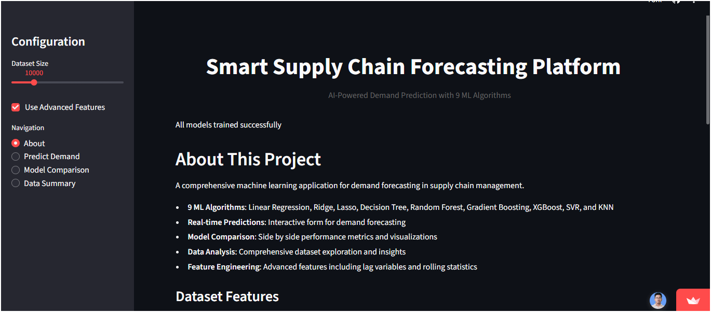
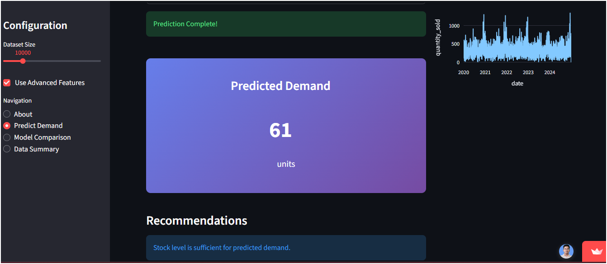
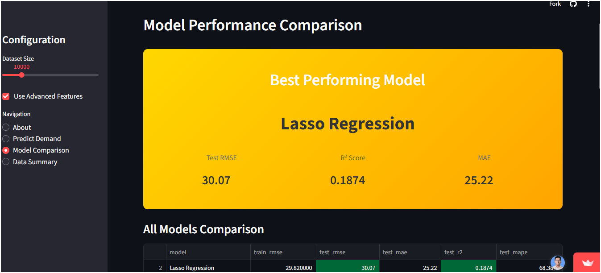
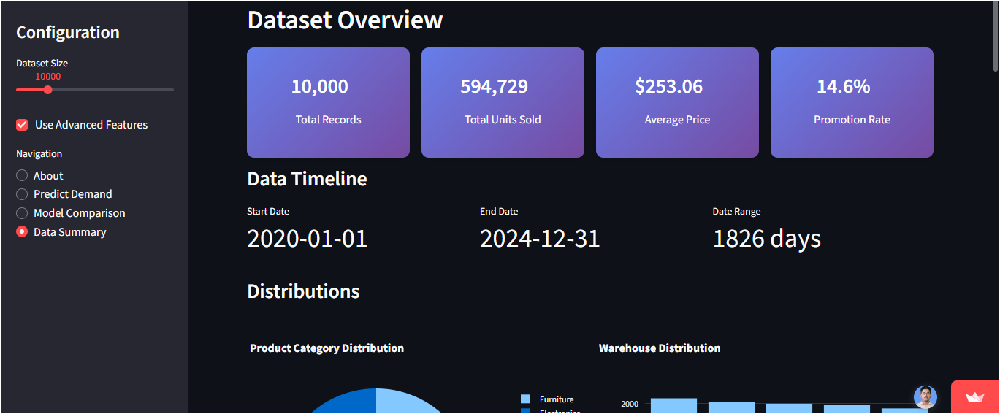

#  All Machine Learning Algorithms – End-to-End Implementation

A comprehensive project showcasing the **implementation, comparison, and deployment of core Machine Learning algorithms** using real-world datasets.  
This repository is designed for **learning, practice, and interview preparation**.

 **Live Application:**  
https://allmlalgos.streamlit.app/

**GitHub Repository:**  
https://github.com/Soumya169/ALL_ML_ALGOS

---

##  Project Objective

The main objective of this project is to:
- Build a **strong foundation in Machine Learning algorithms**
- Understand **end-to-end ML workflow**
- Compare models using standard evaluation metrics
- Deploy ML models using a **Streamlit web application**

This project also serves as a **portfolio project** for Data Analyst / ML Engineer entry-level roles.

---

## Machine Learning Algorithms Implemented

### Supervised Learning
- Linear Regression  
- Multiple Linear Regression  
- Ridge Regression  
- Lasso Regression  
- Logistic Regression  
- K-Nearest Neighbors (KNN)  
- Support Vector Machine (SVM)  
- Decision Tree  
- Random Forest  
- Gradient Boosting  

---

## Model Evaluation Metrics

- Accuracy  
- Mean Absolute Error (MAE)  
- Root Mean Squared Error (RMSE)  
- R² Score  

These metrics are used to **compare and select the best-performing model**.

---

## Web Application (Streamlit)

The Streamlit app allows users to:
- Select different ML algorithms  
- Preprocess datasets  
- Train and test models  
- Visualize predictions and performance  
- Compare multiple models interactively  

**Live Demo:** https://allmlalgos.streamlit.app/

---

##  Tech Stack

- **Programming Language:** Python  
- **Libraries:**  
  - Pandas  
  - NumPy  
  - Scikit-learn  
  - Matplotlib  
  - Seaborn  
- **Frontend:** Streamlit  
- **Tools:** Git, GitHub, Google Colab  

---

## 📸 Application Screenshots

### 🧾 About Project Page
Overview of the Smart Supply Chain Forecasting Platform, supported ML algorithms, and feature engineering.

  

---

### 📈 Demand Prediction
Real-time demand prediction using trained Machine Learning models with interactive inputs.

  

---

### 🧪 Model Performance Comparison
Side-by-side comparison of all models using RMSE, MAE, and R² score to identify the best-performing model.

  

---

### 📊 Dataset Summary & Insights
Comprehensive dataset overview including total records, sales trends, distributions, and warehouse insights.

  

---

## ⭐ Support

If you find this project useful, please consider giving it a **star ⭐**.  
It helps improve visibility and motivates further development.
